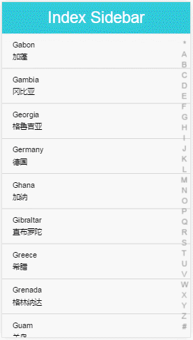

# index-sidebar

A sidebar component with chars as index.



## Usage

Install:

```bash
npm i index-sidebar
```

Require it in your code:

```javascript
var IndexSidebar = require('index-sidebar')

var sidebar = new IndexSidebar()
sidebar.on('charChange', function (ch) {
  console.log(ch)
})
```

Or in your HTML include the script file:

```HTML
<script src="index-sidebar/index.js"></script>
<script>
var sidebar = new IndexSidebar()
sidebar.on('charChange', function (ch) {
  console.log(ch)
})
</script>
```

## How I build this component?

I have wrote a [blog about this](http://www.jianshu.com/p/6b9af9373a14).